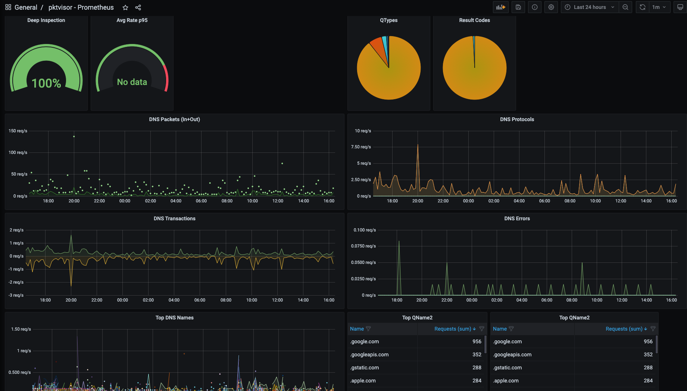
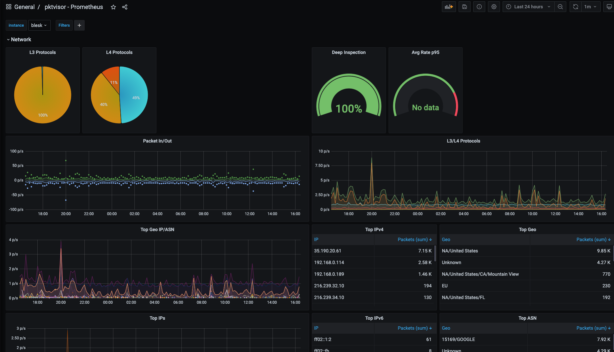

[](https://github.com/ns1labs/pktvisor/actions)
[](https://github.com/ns1labs/pktvisor/security/code-scanning)
[](https://app.codecov.io/gh/ns1labs/pktvisor/tree/develop)

<p align="left">
  <strong>
    <a href="#what-is-pktvisor">Introduction</a>&nbsp;&nbsp;&bull;&nbsp;&nbsp;
    <a href="#get-started">Get Started</a>&nbsp;&nbsp;&bull;&nbsp;&nbsp;
    <a href="#docs">Docs</a>&nbsp;&nbsp;&bull;&nbsp;&nbsp;
    <a href="#build">Build</a>&nbsp;&nbsp;&bull;&nbsp;&nbsp;
    <a href="#contribute">Contribute</a>&nbsp;&nbsp;&bull;&nbsp;&nbsp;    
    <a href="#contact-us">Contact Us</a>
  </strong>
</p>

## What is pktvisor?

**pktvisor** (pronounced "packet visor") is an **observability agent** for analyzing high volume, information dense
network data streams and extracting actionable insights directly from the edge while integrating tightly with modern observability stacks.

It is resource efficient and built from the ground up to be modular and dynamically controlled in
real time via API and YAML policies. Input and analyzer modules may be dynamically loaded at runtime. Metric output can be used and visualized
both on-node via command line UI (for localized, hyper real-time actions)
as well as centrally collected into industry standard observability stacks like Prometheus and Grafana.

The [input stream system](src/inputs) is designed to _tap into_ data streams. It currently supports [packet capture](https://en.wikipedia.org/wiki/Packet_analyzer),
[dnstap](https://dnstap.info/), [sFlow](https://en.wikipedia.org/wiki/SFlow) and [Netflow](https://en.wikipedia.org/wiki/NetFlow)/[IPFIX](https://en.wikipedia.org/wiki/IP_Flow_Information_Export) and will soon support additional taps such as
[envoy taps](https://www.envoyproxy.io/docs/envoy/latest/operations/traffic_tapping), and [eBPF](https://ebpf.io/).

The [stream analyzer system](src/handlers) includes full application layer analysis, and [efficiently](https://en.wikipedia.org/wiki/Streaming_algorithm) summarizes to:

* Counters
* Histograms and Quantiles
* Timers and Rates
* Heavy Hitters/Frequent Items/Top N
* Set Cardinality
* GeoIP/ASN

Please see the list of [current metrics](https://github.com/ns1labs/pktvisor/wiki/Current-Metrics) or the [sample metric output](https://github.com/ns1labs/pktvisor/wiki/Sample-pktvisor-Output-Data).

pktvisor has its origins in observability of critical internet infrastructure in support of DDoS protection, traffic
engineering, and ongoing operations.

These screenshots display both the [command line](golang/) and [centralized views](centralized_collection/) of
the [Network](src/handlers/net) and [DNS](src/handlers/dns) stream processors, and the types of summary information provided:





## Get Started

### Docker

One of the easiest ways to get started with pktvisor is to use
the [public docker image](https://hub.docker.com/r/ns1labs/pktvisor). The image contains the collector
agent (`pktvisord`), the command line UI (`pktvisor-cli`) and the pcap and dnstap file analyzer (`pktvisor-reader`). When running
the container, you specify which tool to run.

1. *Pull the container*

```
docker pull ns1labs/pktvisor
``` 

or use `ns1labs/pktvisor:latest-develop` to get the latest development version.

2. *Start the collector agent*

This will start in the background and stay running. Note that the final two arguments select `pktvisord` agent and
the `eth0` ethernet interface for packet capture. You may substitute `eth0` for any known interface on your device.
_Note that this step requires docker host networking_ to observe traffic outside the container, and
that [currently only Linux supports host networking](https://docs.docker.com/network/host/):

```
docker run --net=host -d ns1labs/pktvisor pktvisord eth0
```

If the container does not stay running, check the `docker logs` output.

3. *Run the command line UI*

After the agent is running, you can observe results locally with the included command line UI. This command will run the
UI (`pktvisor-cli`) in the foreground, and exit when Ctrl-C is pressed. It connects to the running agent locally using
the built in REST API.

```
docker run -it --rm --net=host ns1labs/pktvisor pktvisor-cli
```

### Linux Static Binary (AppImage, x86_64)

You may also use the Linux all-in-one binary, built with [AppImage](https://appimage.org/), which is available for
download [on the Releases page](https://github.com/ns1labs/pktvisor/releases). It is designed to work on all modern
Linux distributions and does not require installation or any other dependencies.

```shell
curl -L http://pktvisor.com/download -o pktvisor-x86_64.AppImage
chmod +x pktvisor-x86_64.AppImage
./pktvisor-x86_64.AppImage pktvisord -h
```

For example, to run the agent on ethernet interface `eth0`:

```
./pktvisor-x86_64.AppImage pktvisord eth0
```

The AppImage contains the collector agent (`pktvisord`), the command line UI (`pktvisor-cli`) and the pcap and dnstap file
analyzer (`pktvisor-reader`). You can specify which tool to run by passing it as the first argument:

For example, to visualize the running agent started above with the pktvisor command line UI:

```shell
./pktvisor-x86_64.AppImage pktvisor-cli
```

Note that when running the AppImage version of the agent, you may want to use the `-d` argument to daemonize (run in the
background), and either the `--log-file` or `--syslog` argument to record logs.

Also see [Advanced Agent Example](#advanced-agent-example).

### Linux Static Binaries (Stand Alone, x86_64)

Finally, pktvisor also provides statically linked, dependency free Linux binaries for each individual pktvisor tool (pktvisord, pktvisor-cli and pktvisor-reader). These are the smallest, most compact versions of the binaries.

pktvisord:
```shell
curl -L http://pktvisor.com/download/pktvisord -o pktvisord-x86_64
chmod +x pktvisord-x86_64
./pktvisord-x86_64 -h
```

pktvisor-cli:
```shell
curl -L http://pktvisor.com/download/cli -o pktvisor-cli-x86_64
chmod +x pktvisor-cli-x86_64
./pktvisor-cli-x86_64 -h
```

pktvisor-reader:
```shell
curl -L http://pktvisor.com/download/reader -o pktvisor-reader-x86_64
chmod +x pktvisor-reader-x86_64
./pktvisor-reader-x86_64 -h
```

### Other Platforms

We are working on support for additional operating systems, CPU architectures and packaging systems. If you do not see your binary available, please see the [Build](#build) section below to build your own.

If you have a preferred installation method that you would like to see support
for, [please create an issue](https://github.com/ns1/pktvisor/issues/new).

### Execute Pktvisord binary without root
Pktvisord uses libpcap to capture PCAP from the desired interface. To do so, it needs system network capture permissions.
You are able to authorize those specific requirements only once and then be able to run the binary without `sudo`.
```shell
sudo setcap cap_net_raw,cap_net_admin=eip /<full_path>/pktvisord-x86_64
```

## Docs

### Agent Usage

Current command line options are described with:

```
docker run --rm ns1labs/pktvisor pktvisord --help
```

or

```
./pktvisor-x86_64.AppImage pktvisord --help
```

```

    Usage:
      pktvisord [options] [IFACE]
      pktvisord (-h | --help)
      pktvisord --version

    pktvisord summarizes data streams and exposes a REST API control plane for configuration and metrics.

    pktvisord operation is configured via Taps and Collection Policies. Taps abstract the process of "tapping into"
    input streams with templated configuration while Policies use Taps to instantiate and configure Input and Stream
    Handlers to analyze and summarize stream data, which is then made available for collection via REST API.

    Taps and Collection Policies may be created by passing the appropriate YAML configuration file to
    --config, and/or by enabling the admin REST API with --admin-api and using the appropriate endpoints.

    Alternatively, for simple use cases you may specify IFACE, which is either a network interface, an
    IP address (4 or 6), or "auto". If this is specified, "default" Tap and Collection Policies will be created with
    a "pcap" input stream on the specified interfaced, along with the built in "net", "dns", and "pcap"
    Stream Handler modules attached. If "auto" is specified, the most used ethernet interface will be chosen.
    Note that this feature may be deprecated in the future.

    For more documentation, see https://pktvisor.dev

    Base Options:
      -d                                    Daemonize; fork and continue running in the background [default: false]
      -h --help                             Show this screen
      -v                                    Verbose log output
      --no-track                            Don't send lightweight, anonymous usage metrics
      --version                             Show version
    Web Server Options:
      -l HOST                               Run web server on the given host or IP (default: localhost)
      -p PORT                               Run web server on the given port (default: 10853)
      --tls                                 Enable TLS on the web server
      --tls-cert FILE                       Use given TLS cert. Required if --tls is enabled.
      --tls-key FILE                        Use given TLS private key. Required if --tls is enabled.
      --admin-api                           Enable admin REST API giving complete control plane functionality [default: false]
                                            When not specified, the exposed API is read-only access to module status and metrics.
                                            When specified, write access is enabled for all modules.
    Geo Options:
      --geo-city FILE                       GeoLite2 City database to use for IP to Geo mapping
      --geo-asn FILE                        GeoLite2 ASN database to use for IP to ASN mapping
      --geo-cache-size N                    GeoLite2 LRU cache size, 0 to disable. (default: 10000)
      --default-geo-city FILE               Default GeoLite2 City database to be loaded if no other is specified
      --default-geo-asn FILE                Default GeoLite2 ASN database to be loaded if no other is specified
    Configuration:
      --config FILE                         Use specified YAML configuration to configure options, Taps, and Collection Policies
                                            Please see https://pktvisor.dev for more information
    Crashpad:
      --cp-disable                          Disable crashpad collector
      --cp-token TOKEN                      Crashpad token for remote crash reporting
      --cp-url URL                          Crashpad server url
      --cp-custom USERDEF                   Crashpad optional user defined field
      --cp-path PATH                        Crashpad handler binary
    Modules:
      --module-list                         List all modules which have been loaded (builtin and dynamic).
      --module-dir DIR                      Set module load path. All modules in this directory will be loaded.
    Logging Options:
      --log-file FILE                       Log to the given output file name
      --syslog                              Log to syslog
    Prometheus Options:
      --prometheus                          Ignored, Prometheus output always enabled (left for backwards compatibility)
      --prom-instance ID                    Optionally set the 'instance' label to given ID
    Metric Enrichment Options:
      --iana-service-port-registry FILE     IANA Service Name and Transport Protocol Port Number Registry file in CSV format
      --default-service-registry FILE       Default IANA Service Name Port Number Registry CSV file to be loaded if no other is specified
    Handler Module Defaults:
      --max-deep-sample N                   Never deep sample more than N% of streams (an int between 0 and 100) (default: 100)
      --periods P                            Hold this many 60 second time periods of history in memory (default: 5)
    pcap Input Module Options:              (applicable to default policy when IFACE is specified only)
      -b BPF                                Filter packets using the given tcpdump compatible filter expression. Example: "port 53"
      -H HOSTSPEC                           Specify subnets (comma separated) to consider HOST, in CIDR form. In live capture this
                                            /may/ be detected automatically from capture device but /must/ be specified for pcaps.
                                            Example: "10.0.1.0/24,10.0.2.1/32,2001:db8::/64"
                                            Specifying this for live capture will append to any automatic detection.
                                                          
```

### Using a Configuration File

pktvisord may be configured at startup by YAML configuration file with the `--config` option.
The configuration file can configure all options that are available on the command line,
as well as defining [Policies](RFCs/2021-04-16-76-collection-policies.md) and [Taps](RFCs/2021-04-16-75-taps.md). All sections are optional.

Note that Policies and Taps may also be maintained in real-time via [REST API](#rest-api).

```yaml
version: "1.0"

visor:
  # optionally define global configuration (see command line options)
  config:
    verbose: true
  # optionally define taps
  taps:
    default_pcap:
      input_type: pcap
      config:
        iface: eth0
      filter:
        bpf: "port 53"          
    unix_dnstap:
      input_type: dnstap
      config:
        socket: "/tmp/dnstap.sock"
    tcp_dnstap:
      input_type: dnstap
      config:
        tcp: "127.0.0.1:53053"
  # optionally define policies
  policies:
    mysocket:
      kind: collection
      input:
        tap: unix_dnstap
        input_type: dnstap
      handlers:
        modules:
          default_net:
            type: net
          default_dns:
            type: dns
            config:
              only_qname_suffix:
                - ".google.com"
                - ".ns1.com"
    mytcp:
      kind: collection
      input:
        tap: tcp_dnstap
        input_type: dnstap
      handlers:
        modules:
          default_net:
            type: net
          default_dns:
            type: dns
```

If running in a Docker container, you must mount the configuration file into the container. For example, if the configuration file
is on the host at `/local/pktvisor/agent.yaml`, you can mount it into the container and use it with this command:

```shell
docker run -v /local/pktvisor:/usr/local/pktvisor/ --net=host ns1labs/pktvisor pktvisord --config /usr/local/pktvisor/agent.yaml --admin-api
```


### Command Line UI Usage

The command line UI (`pktvisor-cli`) connects directly to a pktvisord agent to visualize the real time stream
summarization, which is by default a sliding 5 minute time window. It can also connect to an agent running on a remote
host.

```
docker run --rm ns1labs/pktvisor pktvisor-cli -h
```

```shell
./pktvisor-x86_64.AppImage pktvisor-cli -h
```

```

Usage:
  pktvisor-cli [-p PORT] [-H HOST]
  pktvisor-cli -h
  pktvisor-cli --version

Options:
  -p PORT               Query pktvisord metrics webserver on the given port [default: 10853]
  -H HOST               Query pktvisord metrics webserver on the given host [default: localhost]
  -P POLICY             pktvisor policy to query [default: default]
  --tls	                Use TLS to communicate with pktvisord metrics webserver
  --tls-noverify        Do not verify TLS certificate
  -h                    Show this screen
  --version             Show client version

```

### File Analysis (pcap and dnstap)

`pktvisor-reader` is a tool that can statically analyze prerecorded packet capture and dnstap files.

pcap files can come from many sources, the most famous of which is [tcpdump](https://www.tcpdump.org/). Dnstap files
can be generated from most DNS server software that support dnstap logging, either directly or 
using a tool such as [golang-dnstap](https://github.com/dnstap/golang-dnstap).

Both take many of the same options, and do all of the same analysis, as `pktvisord` for live capture. pcap files may include Flow capture data.

```
docker run --rm ns1labs/pktvisor pktvisor-reader --help
```

```shell
./pktvisor-x86_64.AppImage pktvisor-reader --help
```

```

    Usage:
      pktvisor-reader [options] FILE
      pktvisor-reader (-h | --help)
      pktvisor-reader --version

    Summarize a network (pcap, dnstap) file. The result will be written to stdout in JSON format, while console logs will be printed
    to stderr.

    Options:
      -i INPUT              Input type (pcap|dnstap|sflow|netflow). If not set, default is pcap input
      --max-deep-sample N   Never deep sample more than N% of streams (an int between 0 and 100) [default: 100]
      --periods P           Hold this many 60 second time periods of history in memory. Use 1 to summarize all data. [default: 5]
      -h --help             Show this screen
      --version             Show version
      -v                    Verbose log output
      -b BPF                Filter packets using the given BPF string
      --geo-city FILE       GeoLite2 City database to use for IP to Geo mapping (if enabled)
      --geo-asn FILE        GeoLite2 ASN database to use for IP to ASN mapping (if enabled)
      -H HOSTSPEC           Specify subnets (comma separated) to consider HOST, in CIDR form. In live capture this /may/ be detected automatically
                            from capture device but /must/ be specified for pcaps. Example: "10.0.1.0/24,10.0.2.1/32,2001:db8::/64"
                            Specifying this for live capture will append to any automatic detection.

```

You can use the docker container by passing in a volume referencing the directory containing the pcap file. The standard
output will contain the JSON summarization output, which you can capture or pipe into other tools, for example:
```

$ docker run --rm -v /pktvisor/src/tests/fixtures:/pcaps ns1labs/pktvisor pktvisor-reader /pcaps/dns_ipv4_udp.pcap | jq .

[2021-03-11 18:45:04.572] [pktvisor] [info] Load input plugin: PcapInputModulePlugin dev.visor.module.input/1.0
[2021-03-11 18:45:04.573] [pktvisor] [info] Load handler plugin: DnsHandler dev.visor.module.handler/1.0
[2021-03-11 18:45:04.573] [pktvisor] [info] Load handler plugin: NetHandler dev.visor.module.handler/1.0
...
processed 140 packets
{
  "5m": {
    "dns": {
      "cardinality": {
        "qname": 70
      },
      "period": {
        "length": 6,
        "start_ts": 1567706414
      },
      "top_nxdomain": [],
      "top_qname2": [
        {
          "estimate": 140,
          "name": ".test.com"
        }
      ],
...     
```

The AppImage can access local files as any normal binary:

```

$ ./pktvisor-x86_64.AppImage pktvisor-reader /pcaps/dns_ipv4_udp.pcap | jq .

[2021-03-11 18:45:04.572] [pktvisor] [info] Load input plugin: PcapInputModulePlugin dev.visor.module.input/1.0
[2021-03-11 18:45:04.573] [pktvisor] [info] Load handler plugin: DnsHandler dev.visor.module.handler/1.0
[2021-03-11 18:45:04.573] [pktvisor] [info] Load handler plugin: NetHandler dev.visor.module.handler/1.0
...
processed 140 packets
{
  "5m": {
    "dns": {
      "cardinality": {
        "qname": 70
      },
      "period": {
        "length": 6,
        "start_ts": 1567706414
      },
      "top_nxdomain": [],
      "top_qname2": [
        {
          "estimate": 140,
          "name": ".test.com"
        }
      ],
...     
```

### Metrics Collection

#### Metrics from the REST API

The metrics are available from the agent in JSON format via the [REST API](#rest-api).

For most use cases, you will want to collect the most recent full 1-minute bucket, once per minute:

```
curl localhost:10853/api/v1/metrics/bucket/1
```

This can be done with tools like [telegraf](https://docs.influxdata.com/telegraf/) and
the [standard HTTP plugin](https://github.com/influxdata/telegraf/blob/release-1.17/plugins/inputs/http/README.md).
Example telegraf config snippet for the `default` policy:

```

[inputs]
[[inputs.http]]
urls = [ "http://127.0.0.1:10853/api/v1/metrics/bucket/1",]
interval = "60s"
data_format = "json"
json_query = "1m"
json_time_key = "period_start_ts"
json_time_format = "unix"
json_string_fields = [
  "dns_*",
  "packets_*",
  "dhcp_*",
  "pcap_*",
]

[inputs.http.tags]
t = "pktvisor"
interval = "60"

```

#### Prometheus Metrics

`pktvisord` has native Prometheus support. The `default` policy metrics are
available for collection at the standard `/metrics` endpoint, or use `/api/v1/policies/__all/metrics/prometheus` to collect metrics from all policies.

```shell
$ ./pktvisor-x86_64.AppImage pktvisord -d eth0
$ curl localhost:10853/metrics
# HELP dns_wire_packets_udp Total DNS wire packets received over UDP (ingress and egress)
# TYPE dns_wire_packets_udp gauge
dns_wire_packets_udp{instance="node",policy="default"} 28
# HELP dns_rates_total Rate of all DNS wire packets (combined ingress and egress) per second
# TYPE dns_rates_total summary
dns_rates_total{instance="node",policy="default",quantile="0.5"} 0
dns_rates_total{instance="node",policy="default",quantile="0.9"} 4
dns_rates_total{instance="node",policy="default",quantile="0.95"} 4
...
```

You can set the `instance` label by passing `--prom-instance ID`

If you are interested in centralized collection
using [remote write](https://prometheus.io/docs/operating/integrations/#remote-endpoints-and-storage), including to
cloud providers, there is a [docker image available](https://hub.docker.com/r/ns1labs/pktvisor-prom-write) to make this
easy. See [centralized_collection/prometheus](centralized_collection/prometheus) for more.

Also see [getorb.io](https://getorb.io) for information on connecting pktvisor agents to the Orb observability platform.

### REST API

REST API documentation is available in [OpenAPI Format](https://app.swaggerhub.com/apis/ns1labs/pktvisor/3.0.0-oas3)

Please note that the administration control plane API (`--admin-api`) is currently undergoing heavy iteration and so is
not yet documented. If you have a use case that requires the administration API, please [contact us](#contact-us) to
discuss.

### Advanced Agent Example

Starting the collector agent from Docker with MaxmindDB GeoIP/GeoASN support and using the Host option to identify
ingress and egress traffic:

```
docker run --rm --net=host -d \
    --mount type=bind,source=/opt/geo,target=/geo \
    ns1labs/pktvisor pktvisord \
    --geo-city /geo/GeoIP2-City.mmdb \
    --geo-asn /geo/GeoIP2-ISP.mmdb \
    -H 192.168.0.54/32,127.0.0.1/32 \
    eth0
```

The same command with AppImage and logging to syslog:

```
./pktvisor-x86_64.AppImage pktvisord -d --syslog \
    --geo-city /geo/GeoIP2-City.mmdb \
    --geo-asn /geo/GeoIP2-ISP.mmdb \
    -H 192.168.0.54/32,127.0.0.1/32 \
    eth0
```

### Further Documentation

We recognize the value of first class documentation, and we are working on further documentation including expanded and
updated REST API documentation, internal documentation for developers of input and handler modules (and those who want
to contribute to pktvisor), and a user manual.

Please [contact us](#contact-us) if you have any questions on installation, use, or development.

## Contact Us

We are very interested in hearing about your use cases, feature requests, and other feedback!

* [File an issue](https://github.com/ns1labs/pktvisor/issues/new)
* See existing [issues](https://github.com/ns1labs/pktvisor/issues)
* Start a [Discussion](https://github.com/ns1labs/pktvisor/discussions)
* [Join us on Slack](https://join.slack.com/t/ns1labs/shared_invite/zt-qqsm5cb4-9fsq1xa~R3h~nX6W0sJzmA)
* Send mail to [info@pktvisor.dev](mailto:info@pktvisor.dev)

## Build

The main code base is written in clean, modern C++. The `pktvisor-cli` command line interface is written in Go. The
build system requires CMake and the [Conan](https://conan.io/) package manager system.

pktvisor adheres to [semantic versioning](https://semver.org/).

pktvisor is developed and tested on Linux and OSX. A Windows port is in progress. Both x86_64 and ARM architectures are known to function.

#### Dependencies

* [Conan](https://conan.io/) C++ package manager
* CMake >= 3.13 (`cmake`)
* C++ compiler supporting C++17

For the list of packages included by conan, see [conanfile.txt](conanfile.txt)

#### Building

The general build steps are:

```
# clone the repository
git clone https://github.com/ns1labs/pktvisor.git
cd pktvisor
mkdir build && cd build

# configure and handle dependencies 
cmake -DCMAKE_BUILD_TYPE=Release ..

# build and run tests
make all test

# the binaries will be in the build/bin directory
bin/pktvisord --help
```

As development environments can vary widely, please see
the [Dockerfile](https://github.com/ns1labs/pktvisor/blob/master/docker/Dockerfile)
and [Continuous Integration build file](https://github.com/ns1labs/pktvisor/blob/master/.github/workflows/build.yml) for
reference.

## Contribute

Thanks for considering contributing! We will expand this section with more detailed information to guide you through the
process.

Please open Pull Requests against the `develop` branch. If you are considering a larger
contribution, [please contact us](#contact-us) to discuss your design.

See the [NS1 Contribution Guidelines](https://github.com/ns1/community) for more information.

## License

This code is released under Mozilla Public License 2.0. You can find terms and conditions in the LICENSE file.
