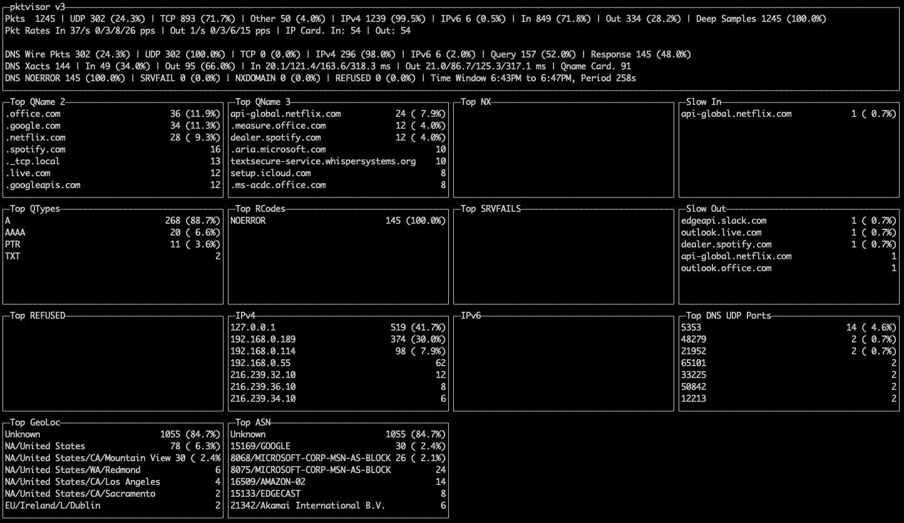
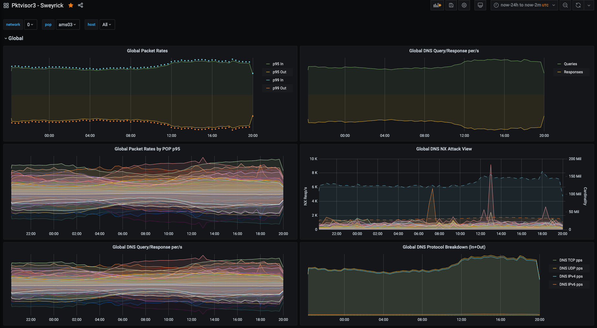

pktvisor
===
> This project is in [active development](https://github.com/ns1/community/blob/master/project_status/ACTIVE_DEVELOPMENT.md).

pktvisor summarizes data streams in real time and provides a clean, time-windowed HTTP interface and command line UI to the results.

Summarized information includes, for example:
* Packet rates: 50th, 90th, 95th, 99th percentiles
* Packet counts by protocol and IP version
* Cardinality of set of source IPs and DNS qnames seen in window
* Top 10 heavy hitters: IPs, ASNs, Geo, DNS qnames, DNS slow xacts...

Although currently DNS and packet capture focused, it is designed to be used in broader contexts.

2019-2020© NSONE, Inc.




Overview
---

pktvisor consists of:
1. A collector daemon which efficiently summarizes streams and exposes a REST API to collect the results
1. A terminal based, command line UI which can visualize the real-time summarized data
1. Tools for collecting and visualizing a globally distributed set of agents to a central location

The agent can also summarize pcap files.

[_drafting_]

API Documentation
---
The REST API documentation, including a description of the metrics that are available, is available in OpenAPI format. See the `docs/` directory.


Getting Started
---

The easiest way to get started with pktvisor is to use the public docker image. The image contains both the command line UI (`pktvisor`) and the collector daemon (`pktvisord`).

1. *Pull the container*
```
docker pull ns1labs/pktvisor
``` 
2. *Start the collector daemon* 

This will run in the background and stay running.
Note that the final two arguments request `pktvisord` binary (with the final 'd' for daemon), 
and to packet capture on the `any` ethernet interface. You may substitute that for
a known interface on your device.
```
docker run --rm --net=host -d ns1labs/pktvisor pktvisord any
```
3. *Run the command line UI*

After the collector is running, you can visualize results locally with the included UI.
This command will run the command line UI (`pktvisor` with no 'd') in the foreground, and exit when Ctrl-C is pressed
```
docker run -it --rm --net=host ns1labs/pktvisor pktvisor
```

See usage examples below for more complex scenarios, including specification of the local host IP(s) and Geo support.

There are currently no prebuilt operating system packages. If you would like to build your own executable,
please see the Build section below.

Collector Daemon Usage
---

A collector daemon should be installed on each node to be monitored.

Current command line options are described with:

```
pktvisord --help
```

```

    Usage:
      pktvisord [-b BPF] [-l HOST] [-p PORT] [-H HOSTSPEC] [--periods P] [--summary] [--geo-city FILE] [--geo-asn FILE]
                [--max-deep-sample N]
                TARGET
      pktvisord (-h | --help)
      pktvisord --version

    pktvisord summarizes your data streams.

    TARGET is either a network interface, an IP address (4 or 6) or a pcap file (ending in .pcap or .cap)

    Options:
      -l HOST               Run metrics webserver on the given host or IP [default: localhost]
      -p PORT               Run metrics webserver on the given port [default: 10853]
      -b BPF                Filter packets using the given BPF string
      --geo-city FILE       GeoLite2 City database to use for IP to Geo mapping (if enabled)
      --geo-asn FILE        GeoLite2 ASN database to use for IP to ASN mapping (if enabled)
      --max-deep-sample N   Never deep sample more than N% of packets (an int between 0 and 100) [default: 100]
      --periods P           Hold this many 60 second time periods of history in memory [default: 5]
      --summary             Instead of a time window with P periods, summarize all packets into one bucket for entire time period.
                            Useful for executive summary of (and applicable only to) a pcap file. [default: false]
      -H HOSTSPEC           Specify subnets (comma separated) to consider HOST, in CIDR form. In live capture this /may/ be detected automatically
                            from capture device but /must/ be specified for pcaps. Example: "10.0.1.0/24,10.0.2.1/32,2001:db8::/64"
                            Specifying this for live capture will append to any automatic detection.
      -h --help             Show this screen
      --version             Show version

```

Command Line UI Usage
---

The command line UI (`pktvisor`) connects to a collector daemon to visualize the real time stream summarization. It can connect to a local or remote agent.

Advanced Collector Daemon Usage Examples
---

Starting the collector daemon from Docker with GeoDB and Host options:

```
docker run --rm --net=host -d --mount type=bind,source=/opt/geo,target=/geo ns1labs/pktvisor pktvisord --geo-city /geo/GeoIP2-City.mmdb --geo-asn /geo/GeoIP2-ISP.mmdb -H 192.168.0.54/32,127.0.0.1/32 any
```


Centralized Collection
---

pktvisor may be collected centrally to give a global view of the collected information.
[_drafting_]

Host Concept
---
Ingress and egress (in/out) related metrics can only be calculated if the agent understands how to identify the host.

[_drafting_]

Build Dependencies
---

* CMake >= 3.8
* Linux or OSX
* C++ compiler supporting C++17
* PcapPlusPlus https://github.com/ns1/PcapPlusPlus

Optional
* MaxMind DB libmaxmindb

Building
---

Building is based on CMake.

Default build:
```
mkdir build; cd build
cmake ..
make
```

Building the docker image:
```
org="myorg"
image="mypktvisor"
tag="latest"
docker build -t ${org}/${image}:${tag} -f Dockerfile .
```

Contributions
---
Pull Requests and issues are welcome. See the [NS1 Contribution Guidelines](https://github.com/ns1/community) for more information.

License
---
This code is released under Apache License 2.0. You can find terms and conditions in the LICENSE file.
